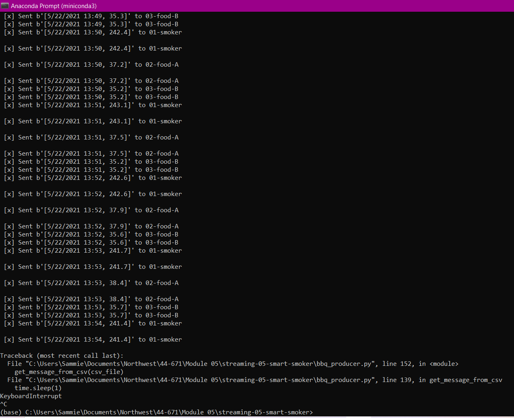
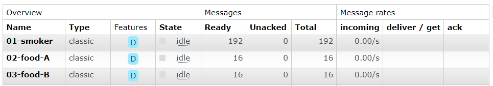

# streaming-06-smart-smoker
Continuing the project from module 05 + consumer

Author: Sammie Bever
Date: February 9, 2023 
Class: Streaming Data 
Assignment: Module 06

This program uses producers, task queues (RabbitMQ), and consumers. 
It reads data from the smoker-temps.csv file for smart smokers.

Creating a producer, consumer, using 3 task_queues, and 3 callbacks.

# Instructions on how to run the program
## Before you begin, adjust your settings in Visual Studio and set-up your conda environment
1. View / Command Palette - then Python: Select Interpreter
2. Select your conda environment. 

## Adjust your code as needed
1. Update your variables and options under the "define variables/constants/options" section of the bbq_producer.py file
2. Update your sleep time, if desired

## Execute the Producer
1. Open Anaconda Prompt Terminal
2. Run bbq_producer.py (say y to monitor RabbitMQ queues)

# Assignment Details
## Using a Barbeque Smoker
When running a barbeque smoker, we monitor the temperatures of the smoker and the food to ensure everything turns out tasty. Over long cooks, the following events can happen:

## The smoker temperature can suddenly decline.
The food temperature doesn't change. At some point, the food will hit a temperature where moisture evaporates. It will stay close to this temperature for an extended period of time while the moisture evaporates (much like humans sweat to regulate temperature). We say the temperature has stalled.

## Sensors
We have temperature sensors track temperatures and record them to generate a history of both (a) the smoker and (b) the food over time. These readings are an example of time-series data, and are considered streaming data or data in motion.

## Streaming Data
Our thermometer records three temperatures every thirty seconds (two readings every minute). The three temperatures are:

the temperature of the smoker itself.
the temperature of the first of two foods, Food A.
the temperature for the second of two foods, Food B.
 
## Significant Events
We want know if:

The smoker temperature decreases by more than 15 degrees F in 2.5 minutes (smoker alert!)
Any food temperature changes less than 1 degree F in 10 minutes (food stall!)

## Smart System
We will use Python to:

Simulate a streaming series of temperature readings from our smart smoker and two foods.
Create a producer to send these temperature readings to RabbitMQ.
Create three consumer processes, each one monitoring one of the temperature streams. 
Perform calculations to determine if a significant event has occurred.
 
## Optional: Alert Notifications
Optionally, we can have our consumers send us an email or a text when a significant event occurs. 
You'll need some way to send outgoing emails. I use my main Gmail account - other options are possible. 

# References:
- Convert string to float (with blank cells in csv) - https://codedamn.com/news/programming/fix-valueerror
- auto-ack: https://www.rabbitmq.com/confirms.html
- SyntaxError: positional argument follows keyword argument - https://www.geeksforgeeks.org/how-to-fix-syntaxerror-positional-argument-follows-keyword-argument-in-python/

# Screenshots of PRODUCER program running
Sometimes my screenshots don't come through to GitHub using the PNG file, so I also use a GitHub link to the photos in my repo

## Running code in Anaconda Prompt Terminal
1 producer

GitHub Link - 

Using file name (PNG) -

## RabbitMQ Server
3 task queues

GitHub Link - 

Using file name (PNG) -

# Screenshots of CONSUMER program running
Sometimes my screenshots don't come through to GitHub using the PNG file, so I also use a GitHub link to the photos in my repo

## Running code in Anaconda Prompt Terminal
1 producer

GitHub Link - 

Using file name (PNG) -

## RabbitMQ Server
3 task queues

GitHub Link - 

Using file name (PNG) -
